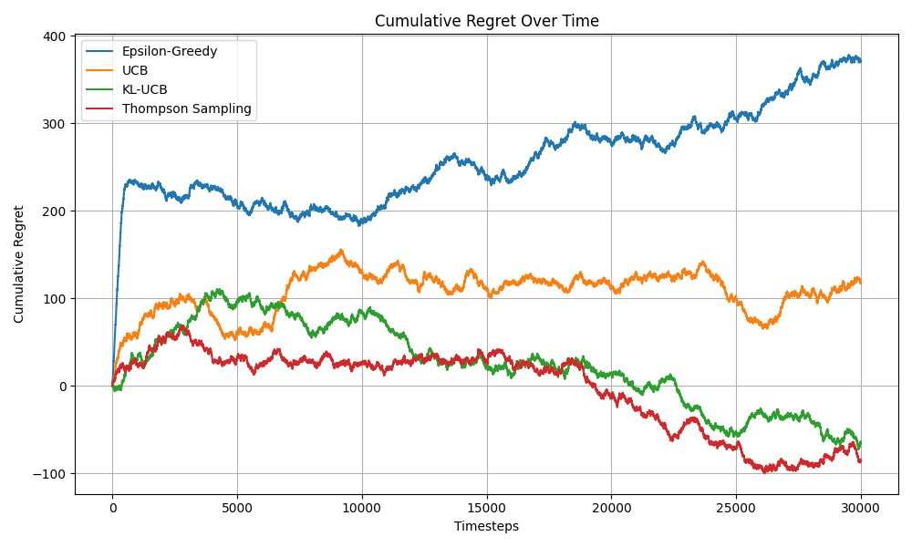
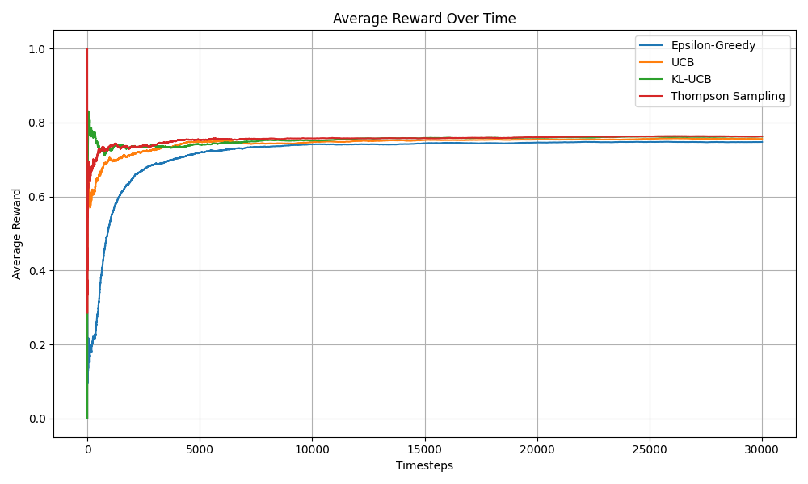
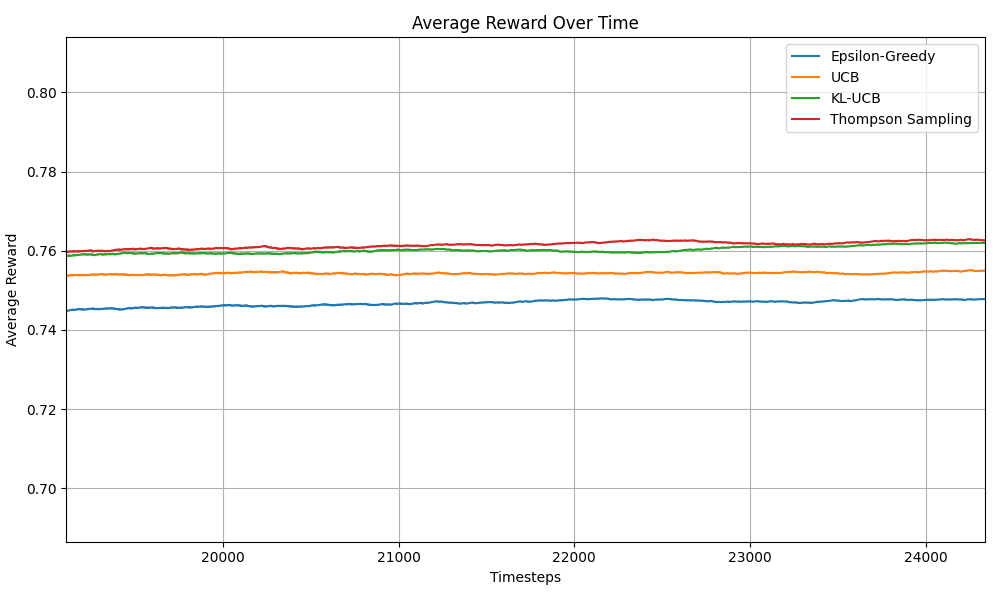
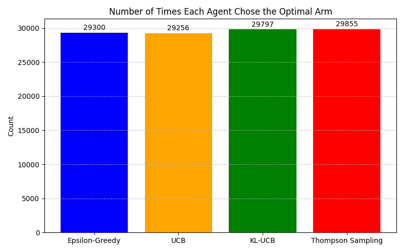
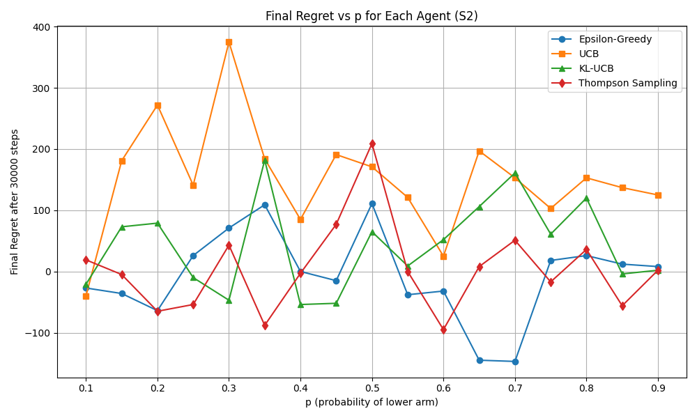

# README: Assignment Solutions

## ✅ Task 1 – Company Employee Database

This task involved creating a simple class-based structure to simulate a company with two types of employees:

- **Engineers**
- **Salespeople**

### 🔧 Implementation Overview

- A base `Employee` class stores basic details like name, ID, position, and department.
- `Engineer` and `Salesperson` are subclasses with role-specific methods or properties.
- A central list stores all employee objects.
- Queries can filter employees by role, department, or ID.

### 💡 Key Features Implemented

- Class inheritance and encapsulation used to organize employee types.
- Polymorphism allows role-based behavior (e.g., `Engineer.code()` or `Salesperson.sell()`).
- A query system in `main.py` demonstrates how to extract and display employee data.

---

## ✅ Task 2 – Multi-Armed Bandits

This repository contains implementations of four bandit agents:

- **Epsilon-Greedy**  
- **UCB (Upper Confidence Bound)**
- **KL-UCB (Kullback-Leibler Upper Confidence Bound)**
- **Thompson Sampling**

Each agent is evaluated on a set of bandit problems (S1 and S2) and the results are visualized via cumulative reward, regret plots, and optimal arm selection frequency.

---

## 📊 Set S1: Vanilla Game (Single Run, 30k Steps)

### ✅ Observations:
- **Cumulative Regret**:
    - KL-UCB and Thompson Sampling have the lowest regret.
    - UCB performs slightly worse than KL-UCB.
    - Epsilon-Greedy has the highest regret due to constant exploration.

- **Cumulative Reward**:
    - Matches the inverse trend of regret. Highest for KL-UCB and Thompson.

- **Optimal Arm Pull Count**:
    - KL-UCB and Thompson Sampling pull the best arm the most times.

### ✅ Conclusion:
- **KL-UCB** and **Thompson Sampling** are best at balancing exploration and exploitation.

---
## 📊 Visualizations – Set S1

### 📉 Cumulative Regret

### 📈 Cumulative Reward

### 🎯 average reward

### 🎯 Frequency of choice as optimal arm

### 🎯 Final regret vs P

--
## 📈 Set S2: 2-Armed Games with Gaps (p vs p+0.1)

### ✅ Setup:
For each pair `(p, p+0.1)` where `p` goes from `0.1` to `0.9` (17 values), agents are evaluated for 30,000 timesteps.

### ✅ Final Regret Observations:

| p     | Eps-Greedy | UCB   | KL-UCB | Thompson |
|-------|------------|--------|--------|-----------|
| 0.1   | High       | Medium | Low    | Low       |
| 0.5   | High       | High   | Medium | Low       |
| 0.9   | Medium     | Medium | Low    | Low       |

### 🧠 Why KL-UCB and UCB behave this way:

- **KL-UCB** adapts better when arms are very close in probability (e.g., p = 0.45 vs 0.55). It uses an information-theoretic distance (KL divergence), which allows more precise control over exploration.

- **UCB** relies on a looser (Hoeffding-based) bound, and hence may underexplore or overexplore slightly when arm gaps are small.

- **Epsilon-Greedy** keeps exploring at a fixed rate regardless of confidence, which leads to unnecessary regret even when the best arm is obvious.

- **Thompson Sampling** naturally adapts to the problem by sampling from posterior beliefs and performs robustly across all settings.

---

> Submission by: Krunal Vaghela  
> GitHub: [KrunalVaghela62](https://github.com/KrunalVaghela62)
